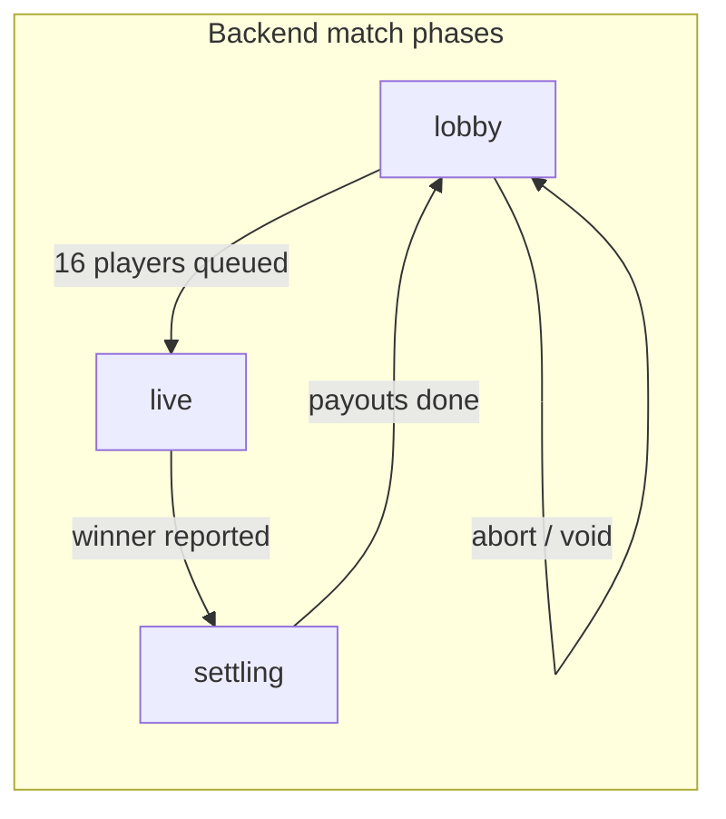

# BedWars.cash — How the game works

Complete reference for players, spectators, and operators: match flow, in-game BedWars rules, the Paper plugin, rewards, betting, and how the pieces connect.

For installation and running locally, see [SETUP.md](./SETUP.md). For VPS/Docker deployment, see [DEPLOY.md](./DEPLOY.md). For internal architecture and code paths, see [DEV_NOTES.md](./DEV_NOTES.md).

**Player-facing guide on the website:** [bedwars.cash/guide](/guide) (React app route).

---

## What this is

**BedWars.cash** is a skill-based BedWars server on **Solana devnet** (free test SOL — not real money). One match runs at a time:

| Setting | Default |
|---------|---------|
| Teams | Green, Blue, Red, Yellow |
| Players per team | 4 |
| Total fighters | 16 |
| Format | 4v4v4v4 |

Two separate money flows exist:

| Pool | Who | Funded by | Paid out as |
|------|-----|-----------|-------------|
| **Player reward pool** | The 16 queued fighters | House wallet (intended: Pump.fun creator fees; devnet: manual top-ups) | On-chain SOL to each winner's `/setwallet` address, split equally among the winning team |
| **Spectator betting pool** | Linked web/in-game bettors | Custodial balances (deposited devnet SOL) | Internal ledger credits via parimutuel settlement (95% to winners, 5% house rake) |

The **backend** owns match phase, queue, bets, balances, and settlement. The **Paper plugin** runs the embedded BedWars arena and reports results over WebSocket. No external BedWars2023/2026 plugin is required.

---

## Quick start by role

### Fighter (queued player)

1. Join the Minecraft server — you are auto-queued in the lobby (unless a match is already live).
2. Run `/setwallet <solana_address>` so match winnings can be sent on-chain.
3. Optionally link your website account: get a code on [bedwars.cash](https://bedwars.cash) → `/bwlink <code>`.
4. When 16 players are queued, the match starts: countdown → teleport to your team island → fight.
5. Protect your bed, rush others, last team standing wins.
6. Winners split the **player reward pool** equally (4 ways by default).
7. After winning, you sit out **one match** (win cooldown) and spectate the next round.

### Spectator / bettor

1. Open the web app (`/play` dashboard) — a custodial account and deposit wallet are created automatically.
2. Deposit devnet SOL to your deposit address; balance credits within ~15 seconds.
3. Link Minecraft: generate a link code on the site → `/bwlink <code>` in-game.
4. While phase is **lobby**, bet in-game: `/bet <green|blue|red|yellow> <amountSol>`.
5. Betting **locks when the match starts**. Watch the live stream (if configured) and odds on the website.
6. If your team wins, you receive a share of 95% of the betting pool proportional to your stake.

### Operator / admin

- Force-start with fewer players: `/bwc forcestart` or `POST /api/admin/force-start`.
- Abort a broken match: `/bwc end` — all bets refunded, queue cleared.
- Manual winner (fallback): `/bwresult <green|blue|red|yellow>`.
- Fund the house wallet for reward pools: see [Funding the reward pool](#funding-the-reward-pool).

---

## Match lifecycle



### 1. Lobby

- Backend always maintains a match in **lobby** phase when idle.
- Joining the server queues you (unless the match is live/settling or you are on win cooldown).
- Spectators and linked users can `/bet` while phase is `lobby`.
- **Queued fighters cannot bet** on their own match (anti-collusion).
- Scoreboard shows queue size, reward pool, bet pool, and match status.

### 2. Match start

When the queue reaches `MATCH_PLAYER_COUNT` (default 16):

1. Backend assigns teams (parties stay together, max `TEAM_SIZE` per team).
2. Backend snapshots the **available reward pool** from the house wallet.
3. Phase becomes **live**; plugin receives `start_match` with team rosters.
4. Plugin runs a countdown (`game.countdown-seconds`, default 10), teleports fighters to the arena waiting area, then to team islands.
5. Generators start; shop and upgrade villagers spawn.

**Force start:** ops can begin with fewer than 16 players via `/bwc forcestart`.

### 3. Live play

- Standard BedWars: break enemy beds → eliminate respawns → last team with alive members wins.
- Plugin detects bed breaks and player deaths; reports winner to backend on match end.
- Fallback: op runs `/bwresult <team>`.
- Late joiners during live/settling → spectator mode; they cannot join the current fight.

### 4. Settlement

When a winner is reported:

1. Phase → **settling**.
2. **Parimutuel:** bettors on the winning team split 95% of the betting pool by stake. If nobody bet on the winner, all bets are **refunded** (no rake).
3. **Player rewards:** winning team UUIDs split `rewardPoolLamports` equally via on-chain transfer to each player's `/setwallet` address. No wallet set → credited to custodial balance.
4. Winners get a **1-match cooldown**.
5. New lobby opens; odds and state broadcast to plugin and web.

### 5. Abort / void

`/bwc end`, admin abort, or plugin `match_aborted` → all bets refunded, queue cleared, new lobby.

---

## In-game BedWars (embedded plugin)

The **BedWarsCash** plugin (v0.1.0) includes a full mini-game — no third-party BedWars plugin.

### Worlds

| World | Purpose | Default mode |
|-------|---------|--------------|
| `bwc_lobby` | Hub, queue, betting pads | Procedural void platform, or custom imported map |
| `bwc_arena` | Match arena | Procedural 4-island void map, or custom imported map |

Configure in `plugins/BedWarsCash/config.yml`:

```yaml
lobby:
  mode: procedural   # or custom
  template: ""       # map folder name under plugins/BedWarsCash/maps/
  world: bwc_lobby

arena:
  mode: procedural
  template: ""
  world: bwc_arena
```

See [Custom maps](#custom-maps) below.

### Match flow (plugin)

1. **Countdown** — fighters at arena waiting spawn; PvP and damage disabled.
2. **Fight** — teleport to team island with starter kit:
   - Wooden sword (permanent, no durability bar)
   - 16 blocks of team-colored wool
   - Nether star (slot 9) → opens item shop
3. **Resources** — generators drop iron, gold, diamond, emerald ingots at configured intervals.
4. **Shops** — `/shop`, right-click item shop villager, or use the nether star.
5. **Upgrades** — `/upgrades` or right-click upgrade villager (team-wide, paid with diamonds/gold).
6. **Bed destroyed** — team can no longer respawn; further deaths are **final kills**.
7. **Win** — last team with at least one non-eliminated member; MVP announced by kills/beds.

### Combat rules

- **Friendly fire disabled** — teammates cannot damage each other (melee, arrows, fireballs, TNT from teammates).
- **Void death** — falling below Y=50 in the arena kills you (respawn if bed alive, else spectator).
- **Block rules** — only **player-placed** blocks can be broken; map terrain is protected.
- **Beds** — breaking your own bed is blocked; enemy beds announce globally with title/sound.

### Generators (default timings)

| Generator | Location | Interval | Stack limit |
|-----------|----------|----------|-------------|
| Iron | Each team island | ~0.5 s | 128 |
| Gold | Each team island | ~2 s | 32 |
| Diamond | Mid map (4 points) | ~30 s | 6 |
| Emerald | Mid map (2 points) | ~60 s | 2 |

**Iron Forge** team upgrade speeds iron/gold spawn for that team.

> **Note:** `generators.yml` defines tiered events (Diamond II, Beds Gone, Sudden Death) for future use. The live plugin currently uses fixed tier-I values in code. Game events are not yet wired at runtime.

### Item shop

Configured in `plugins/BedWarsCash/shop.yml`. Categories:

| Category | Examples |
|----------|----------|
| Quick Buy | Wool, stone sword, chainmail, gapple, bow, speed potion, TNT |
| Blocks | Wool, terracotta, glass, end stone, ladders, wood, obsidian |
| Melee | Stone/iron/diamond swords, knockback stick |
| Armor | Permanent chainmail / iron / diamond sets |
| Tools | Shears, tiered pickaxes and axes |
| Ranged | Arrows, bow, power bow, punch bow |
| Potions | Speed II, Jump V, invisibility |
| Utility | Gapple, bedbug, dream defender, fireball, TNT, ender pearl, tracker, bridge egg, milk, sponge, pop-up tower |

Wool from the shop is automatically dyed to your **team color**.

**Special items** (partial implementation):

| Item | Status |
|------|--------|
| Fireball, bridge egg, bedbug, TNT, tracker | Working |
| Dream defender, pop-up tower, magic milk, sponge | In shop; handlers not yet implemented |

### Team upgrades

Configured in `plugins/BedWarsCash/upgrades.yml`:

| Upgrade | Effect | Currency |
|---------|--------|----------|
| Sharpened Swords | Sharpness on all swords (4 tiers) | Diamond |
| Reinforced Armor | Protection on all armor (4 tiers) | Diamond |
| Iron Forge | Faster iron/gold generators (4 tiers) | Gold |
| Maniac Miner | Haste near your island (2 tiers) | Diamond |

Upgrades apply to **the whole team** for the current match only.

### Spectator mode

Non-fighters and eliminated players:

- Adventure mode, flight, invisibility to fighters
- Cannot break/place blocks, pick up items, or open inventories
- Can use `/bet` during lobby phase
- Message prompts: `/bet <team> <sol>`

---

## Commands reference

### Player commands

| Command | Description |
|---------|-------------|
| `/setwallet <address>` | Solana address for match reward payouts |
| `/bwlink <code>` | Link website account (code from web dashboard) |
| `/bet <team> <sol>` | Parimutuel bet on Green/Blue/Red/Yellow |
| `/bets` | In-game betting board GUI |
| `/queue` | Join match queue manually |
| `/queue leave` | Leave queue (and party queue) |
| `/shop` | Open item shop during live match |
| `/upgrades` | Open team upgrades shop |
| `/party invite <player>` | Invite to party (same team at match start) |
| `/party accept` | Accept party invite |
| `/party leave` | Leave or disband party |
| `/party list` | Show party members |

Teams: `green`, `blue`, `red`, `yellow` (case-insensitive for bets).

### Admin commands (`bedwarscash.admin`)

| Command | Description |
|---------|-------------|
| `/bwc setlobby` | Set lobby spawn (stand at location) |
| `/bwc setwait` | Set arena countdown/waiting spawn |
| `/bwc setbed <team>` | Bind team bed while looking at it |
| `/bwc forcestart` | Start match with fewer than 16 players |
| `/bwc end` | Abort match, refund bets |
| `/bwresult <team>` | Manually report winning team |

---

## Economy & rewards

### Custodial accounts (web + linked Minecraft)

Each user gets:

- A **session token** (Bearer auth on the web API)
- A unique **deposit wallet** (Solana keypair; secret encrypted with `APP_SECRET`)
- An internal **balance** in lamports (SQLite)

**Deposit flow:** send devnet SOL to your deposit address → backend polls every ~15s → credits balance → sweeps SOL to the **house hot wallet**.

**Withdraw flow:** request from web dashboard → signed by house wallet → sent to your chosen address. Large withdrawals may be held for manual review (`MANUAL_REVIEW_THRESHOLD_SOL`).

### Player reward pool

Snapshotted when the match goes **live**:

```
availableRewardPool = houseWalletBalance
                    − HOUSE_RESERVE_SOL
                    − sum(all user custodial balances)
                    − (optional REWARD_POOL_CAP_SOL)
```

The winning team splits this pool **equally** (4 shares by default). Lamport remainder is distributed one lamport at a time so the total is exact.

**Payout destination:**

1. `/setwallet` address → on-chain `houseTransfer`
2. No wallet → custodial balance credit (withdraw later)

### Win cooldown

Winners cannot queue for the **next** match. They join as spectators and can still bet on others (they are not in the queue).

### Funding the reward pool

On devnet, Pump.fun fee sweep is **mocked**. Fund the house wallet manually:

| Method | How |
|--------|-----|
| Admin top-up | `POST /api/admin/topup { "sol": 2 }` with `x-admin-token: <APP_SECRET>` |
| Script | `node backend/scripts/fund.mjs <houseAddress> 1` |
| Solana CLI | `solana airdrop 1 <houseAddress> --url devnet` |
| Web faucet | https://faucet.solana.com |

House address is printed on backend first run (`backend/wallets/house.json`).

---

## Spectator betting (parimutuel)

Separate from the player reward pool. Bettors wager custodial SOL on which **team wins**.

### Rules

- Bets only accepted while phase is **lobby**.
- Min/max per bet: `MIN_BET_SOL` / `MAX_BET_SOL` (default 0.01 – 100 SOL).
- **Queued fighters cannot bet** on the match they are playing.
- Multiple bets on the same team are allowed (stakes add up).
- House rake: **5%** of total pool (`BETTING_RAKE=0.05`).

### Dynamic odds

Odds are **not fixed**. They shift as bets arrive:

```
netPool = totalBets − rake
impliedMultiplier(team) = netPool / totalStakedOn(team)
```

Example: if Green has 2 SOL staked and the net pool is 10 SOL, Green bettors would share at ~5× their stake if Green wins (before considering other teams' stakes).

### Settlement

| Outcome | Result |
|---------|--------|
| Your team wins | Proportional share of 95% of pool |
| Your team loses | Stake lost |
| Nobody bet on winner | **Full refund** to all bettors, no rake |
| Match aborted | **Full refund** to all bettors |

Payouts credit your **custodial balance** (not automatic on-chain unless you withdraw).

### Placing bets

- **In-game:** `/bet green 0.5` (requires linked account with balance)
- **Web:** dashboard shows live odds; betting is primarily in-game today

---

## Parties

- Invite with `/party invite <player>`; accept with `/party accept`.
- Max party size = `TEAM_SIZE` (default 4).
- When queuing, **the whole party joins together**.
- At match start, parties are assigned to the **same team** when possible.
- Parties are stored **in memory** on the backend — lost on backend restart.

---

## Custom maps

Import complete Minecraft world folders to `plugins/BedWarsCash/maps/<name>/`:

```
plugins/BedWarsCash/maps/my_arena/
  level.dat
  region/
  ...
```

Set `mode: custom` and `template: my_arena` in config for lobby and/or arena.

### Custom arena detection

The plugin scans for:

- **Team beds** — green/red/blue/yellow bed blocks (head part)
- **Generators** — iron/gold blocks near islands; diamond/emerald at mid
- **Spawns** — derived from bed facing

Admin setup commands:

- `/bwc setwait` — countdown area
- `/bwc setbed green` (etc.) — if auto-scan misses a bed

To re-import after editing a template: delete `server/bwc_arena/` (or your configured world folder) and restart.

---

## Web dashboard

Route: `/play` (React app)

| Feature | Description |
|---------|-------------|
| Wallet | Balance, deposit QR/address, withdraw form |
| Link code | Generate code for `/bwlink` |
| Live odds | Team pools, implied multipliers, phase via WebSocket |
| Reward pool | Available SOL for next/current match |
| Leaderboard | Top bettors (net profit), top players (reward winnings) |
| Live stream | HLS video or iframe embed when `STREAM_URL` is set |

Session is created automatically on first visit (localStorage token).

---

## Plugin configuration

File: `plugins/BedWarsCash/config.yml` (generated on first run)

| Section | Key | Description |
|---------|-----|-------------|
| `backend` | `ws-url` | WebSocket URL (e.g. `ws://localhost:8787/ws/plugin`) |
| `backend` | `token` | Must match backend `PLUGIN_TOKEN` |
| `join` | `auto-queue` | Queue on join (default true) |
| `game` | `countdown-seconds` | Pre-fight countdown (default 10) |
| `anticheat` | `max-cps` | Autoclicker flag threshold (default 20) |
| `broadcast` | `enabled` | Rotate cast camera across teams |
| `broadcast` | `username` | Minecraft account for OBS capture |
| `lobby` / `arena` | `mode`, `template`, `world` | Procedural vs custom maps |

**Dependencies:** Paper 26.1.2+, Java 25. Optional soft-depend: **GrimAC** (movement/combat checks).

---

## Backend configuration (game economy)

File: `backend/.env`

| Variable | Default | Description |
|----------|---------|-------------|
| `MATCH_PLAYER_COUNT` | 16 | Fighters needed to auto-start |
| `TEAM_SIZE` | 4 | Max players (and party size) per team |
| `BETTING_RAKE` | 0.05 | House cut of spectator pool |
| `MIN_BET_SOL` | 0.01 | Minimum single bet |
| `MAX_BET_SOL` | 100 | Maximum single bet |
| `HOUSE_RESERVE_SOL` | 0.5 | SOL floor kept in house wallet |
| `REWARD_POOL_CAP_SOL` | 0 | Optional cap per match (0 = none) |
| `FEE_SOURCE` | mock | `mock` on devnet; `pumpfun` planned for mainnet |
| `PLUGIN_TOKEN` | — | Shared secret with plugin WebSocket |
| `STREAM_URL` | — | Optional HLS/embed for website |

---

## Anti-cheat & fair play

| Check | Behavior |
|-------|----------|
| GrimAC | Soft-depend; handles movement/combat if installed |
| CPS limit | Plugin flags sustained clicks above `max-cps`; logged to backend |
| Anti-collusion | Queued players cannot bet on their own match |
| Deposit wallet age | Rejects very new deposit-source wallets (`MIN_WALLET_AGE_HOURS`) |
| Cheat flags | Logged via WebSocket; no automatic ban yet |

---

## Live streaming (optional)

1. Create a dedicated account (e.g. `BWC_Cast`) logged into the server during matches.
2. Enable in plugin config (`broadcast.enabled: true`).
3. Capture that client with OBS/ffmpeg → media server (OvenMediaEngine, etc.).
4. Set `STREAM_URL` in backend `.env` (HLS `.m3u8` recommended).

The plugin rotates the cast client's perspective across teams every `seconds-per-team`. The website shows the stream and current camera target during live matches.

---

## Architecture (high level)

```
Minecraft players ──WebSocket──► Backend (match, queue, bets, settlement)
Web dashboard   ──REST/WS────► Backend
Backend         ──Solana──────► House wallet + user deposit wallets
Paper plugin    ──embedded───► GameManager, WorldManager, shops, generators
```

**Single source of truth:** the backend. The plugin is a game client that runs arenas and forwards player actions.

---

## Known limitations

| Area | Status |
|------|--------|
| Devnet only | No mainnet / real-money support |
| One match at a time | By design |
| Procedural maps | Minimal void islands; use custom maps for production quality |
| Game events | Diamond II/III, Beds Gone, Sudden Death — config exists, not wired |
| Some shop utilities | Dream defender, tower, milk, sponge — not implemented |
| Parties | In-memory; lost on backend restart |
| Pump.fun fees | Stub on devnet; use manual house funding |
| Live match telemetry | Bed status/kills not streamed to web mid-match |
| Disconnect/rejoin | No rejoin slot if you drop mid-match |
| Spawn protection | None after countdown |

---

## Related docs

| Doc | Contents |
|-----|----------|
| [SETUP.md](./SETUP.md) | Install backend, web, plugin, server |
| [DEPLOY.md](./DEPLOY.md) | Docker, Caddy, production URLs |
| [DEV_NOTES.md](./DEV_NOTES.md) | Code layout, WebSocket protocol, file index |

---

## FAQ

**Do I need the website to play?**  
No for fighting — join and queue. Yes for spectator betting (deposit + link account). `/setwallet` works without linking but linking ties your Minecraft UUID to your custodial account for bets.

**Can I bet and play the same match?**  
No. If you are in the queue for the current lobby, bets on that match are rejected.

**Where do winnings go?**  
- **Fighters:** on-chain to `/setwallet`, or custodial balance if unset.  
- **Bettors:** custodial balance (withdraw from web).

**What if nobody bets on the winning team?**  
All bets are refunded; no rake taken.

**How do I get test SOL?**  
Deposit devnet SOL to your web deposit address, or fund the house wallet for reward pools (see above).

**Can we run 1v1 or 2v2?**  
Set `MATCH_PLAYER_COUNT` and `TEAM_SIZE` in backend `.env` (e.g. `4` and `1` for 1v1v1v1). Force-start may be needed if the queue does not fill.
